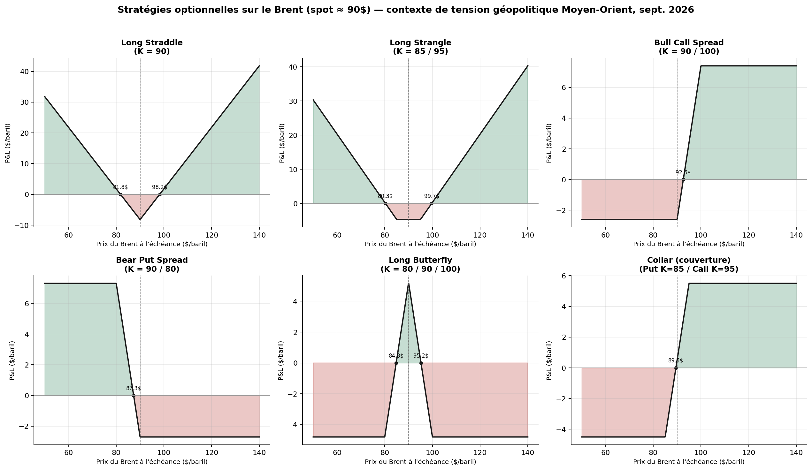

# Stratégies optionnelles sur le pétrole (Brent) — Payoffs & Breakevens

Projet Python illustrant 6 stratégies optionnelles classiques (straddle, strangle,
bull call spread, bear put spread, butterfly, collar) appliquées au Brent Crude Oil,
dans le contexte de tension géopolitique Moyen-Orient de fin août / septembre 2026
(spot ≈ 90 $/baril).

Base théorique : Hull, *Options, Futures and Other Derivatives*, Chapitre 11.

## Aperçu



## Structure du projet

```
options_project/
├── src/
│   ├── payoffs.py       # fonctions de payoff élémentaires (call/put, long/short)
│   ├── strategies.py    # composition des 6 stratégies + primes + tableau de synthèse
│   └── plots.py         # génération des graphiques (individuels + planche comparative)
├── charts/               # graphiques générés (.png)
├── summary.json          # tableau de synthèse exporté (breakeven, gain/perte max)
├── build_report.js       # génération du rapport Word (docx)
└── Rapport_Strategies_Options_Brent.docx
```

## Utilisation

```bash
cd src
python3 strategies.py   # affiche le tableau de synthèse en console
python3 plots.py        # régénère tous les graphiques dans ../charts
```

## Stratégies couvertes

| Stratégie | Vue de marché | Strikes |
|---|---|---|
| Long Straddle | Forte volatilité, sens indéterminé | K = 90 |
| Long Strangle | Forte volatilité, prime réduite | K = 85 / 95 |
| Bull Call Spread | Hausse modérée | K = 90 / 100 |
| Bear Put Spread | Baisse modérée | K = 90 / 80 |
| Long Butterfly | Stabilisation autour de 90$ | K = 80 / 90 / 100 |
| Collar | Couverture d'une position longue physique | Put K=85 / Call K=95 |

## Limites du modèle

- Primes approximées manuellement, non calibrées sur une surface de volatilité implicite réelle.
- Échéance unique modélisée (pas d'évolution du payoff dans le temps / theta).
- Prolongement naturel : pricing des primes par arbre binomial (Hull, chapitre 12).

## Licence

Projet pédagogique, libre d'utilisation.
